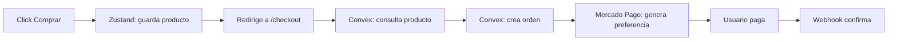
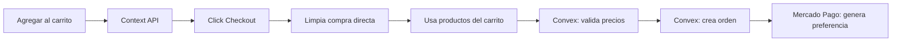

```markdown
# 🎲 Dominoes | Tu mesa de juegos

Aplicación de ecommerce moderna construida con **Next.js**, **Convex**, **Clerk** y **Mercado Pago**. Diseñada con arquitectura escalable y enfoque en seguridad.

## ✨ Características Principales

- 🛒 **Compra directa** de un solo producto
- 🛍️ **Checkout completo** desde carrito
- 🔐 **Autenticación segura** con Clerk (roles admin/cliente)
- 💳 **Pagos reales** con Mercado Pago (Checkout Pro)
- 📦 **Gestión de órdenes** en backend con validación de precios
- 👑 **Panel de administración** para gestión de productos
- ⚡ **Actualizaciones en tiempo real** con Convex

## 🚀 Tecnologías

| Tecnología | Uso |
|------------|-----|
| [Next.js](https://nextjs.org/) (App Router) | Framework principal |
| [Clerk](https://clerk.com/) | Autenticación y usuarios |
| [Convex](https://www.convex.dev/) | Backend serverless + BD en tiempo real |
| [Mercado Pago](https://www.mercadopago.com.ar/) | Procesamiento de pagos |
| [Zustand](https://github.com/pmndrs/zustand) | Estado temporal (checkout) |
| [Context API](https://react.dev/reference/react/useContext) | Estado del carrito |

## 🏗️ Arquitectura

### Flujo de Compra Directa



### Flujo de Compra desde Carrito



## 📁 Estructura del Proyecto

```
📦 dominoes
├── 📱 app/                    # Next.js App Router
│   ├── 🏠 page.tsx            # Home
│   ├── 📦 product/            # Página de producto
│   ├── 💳 checkout/           # Checkout
│   ├── 👑 dashboard/          # Panel admin
│   └── 📡 api/                 # API routes
├── ⚡ convex/                  # Backend Convex
│   ├── 📄 products.ts          # Productos
│   ├── 📄 orders.ts            # Órdenes
│   └── 📄 users.ts             # Usuarios + sync con Clerk
├── 🗂️ stores/                  # Zustand stores
│   └── checkoutStore.ts
├── 🛒 context/                  # Context API
│   └── cartContext.tsx
├── 🪝 hooks/                    # Custom hooks
│   ├── useUser.ts              # Hook de usuario + admin
│   └── useCheckout.ts
└── 📦 components/               # Componentes reutilizables
```


## 🛠️ Instalación y Uso

```bash
# Clonar repositorio
git clone https://github.com/TiendaDominoes/Dominoes

# Instalar dependencias
npm install

# Iniciar Convex (desarrollo)
npx convex dev

# Iniciar app
npm run dev
```

La app estará disponible en `http://localhost:3000`

## 👑 Roles de Usuario

### Admin
- Crear y gestionar productos
- Ver todas las órdenes
- Acceso al dashboard

### Cliente
- Navegar productos
- Agregar al carrito
- Realizar compras
- Ver historial de órdenes

## 📦 Scripts Disponibles

```bash
npm run dev          # Desarrollo
npm run build        # Build producción
npm run start        # Iniciar producción
npm run lint         # Linter
npx convex dev       # Desarrollar Convex
npx convex deploy    # Deploy Convex
```
